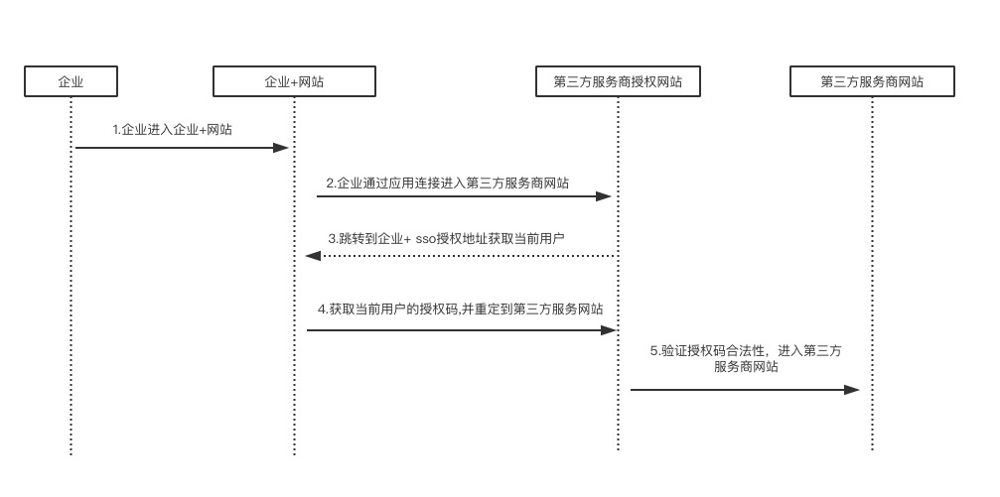

# docs
企业+ 第三方应用接入文档

## 单点登录

### 企业+官网跳转到第三方服务商网站流程


### 步骤说明
1. 第三方服务授权重定向 企业+授权地址
2. 企业+网站授权用户之后，重写向第三方服务网站的回调地址并带上授权码
3. 第三方服务网站，检查企业+的授权码，合法后写入用户登录信息

* 第三方服务商的应用需要提供
1. 第三方应用针对企业+的入口地址，如： http://example.com/qyhub
2. 第三方应用的sso 授权地址，如：http://example.com/sso/auth
3. 第三方应用的sso 回调地址，如：http://exmaple.com/sso/callback


### 企业+登录授权地址

*  请求地址

`https://qyhub.cn/serv/sso/auth?client_id=YOUR_APP_ID&callback=YOUR_SSO_AUTH_CALLBACK_URL&redirect_uri=YOUR_APP_REDIRECT_URI`

参数说明


| 参数           | 必须          | 说明  |
| ------------- |:-------------:| :-----|
| client_id    | 是  | 在企业+申请的应用Id |
| callback     | 是       | 企业+认证成功重定向到应用的地址，在企业+申请时填写的回调地址 |
| redirect_uri | 是       | 第三方应用认证成功后重定向的地址|

*  在企业+进行认证，认证成功重定向第三应用的sso回调址址

  `YOUR_SSO_AUTH_CALLBACK_URL?token=SSO_AUTH_TOKEN&redirect_uri=YOUR_APP_REDIRECT_URI`

   step 1. 验证token是否合法
           通过jwt(https://jwt.io/)来解码token,得到当前的用户信息(eid,userid,name,email,avatar,ts)


   step 2. 合法，进行本地认证，然后跳向YOUR_APP_REDIRECT_URI; 不合法，给出提示信息

   ```js
     tokenInfo = jwt.decode(token,appsecret);

     //1. 检查解密是否成功
     //2. 检查tokenInfo.ts与当前时间对比,如果大于60s，给出超时提示
     //3. 检查用户是否合法
   ```


### 用户同步
1. 获取token

    GET `https://qyhub.cn/api/getToken?appid=YOUR_APP_ID&appsecret=YOUR_APP_SECRET`

    返回数据
    ```json
    {
      "errcode":0,
      "token":"ACCESS_TOKEN"
    }
    ```

2. 同步增量用户（新增，更新，删除）

    POST `https://qyhub.cn/api/get_sync_app_user?access_token=ACCESS_TOKEN`

    发送数据

    ```
    {
      "eid":"企业ID",
      "appid":"YOUR_APP_ID",
      "ts":"同步时间"
    }
    ```

    返回数据

    ```
    {
      errcode:0,
      data:{
        need_sync_users:[
        {
          userid:'u001',
          'eid':'e001',
          'email':'xxx@qyhub.cn',
          'name':'张三',
          'avatar':"https://qyhub.cn/qq/avatar.jpg"
        }],
        userids:['u001','u002']
      }
    }
    ```
